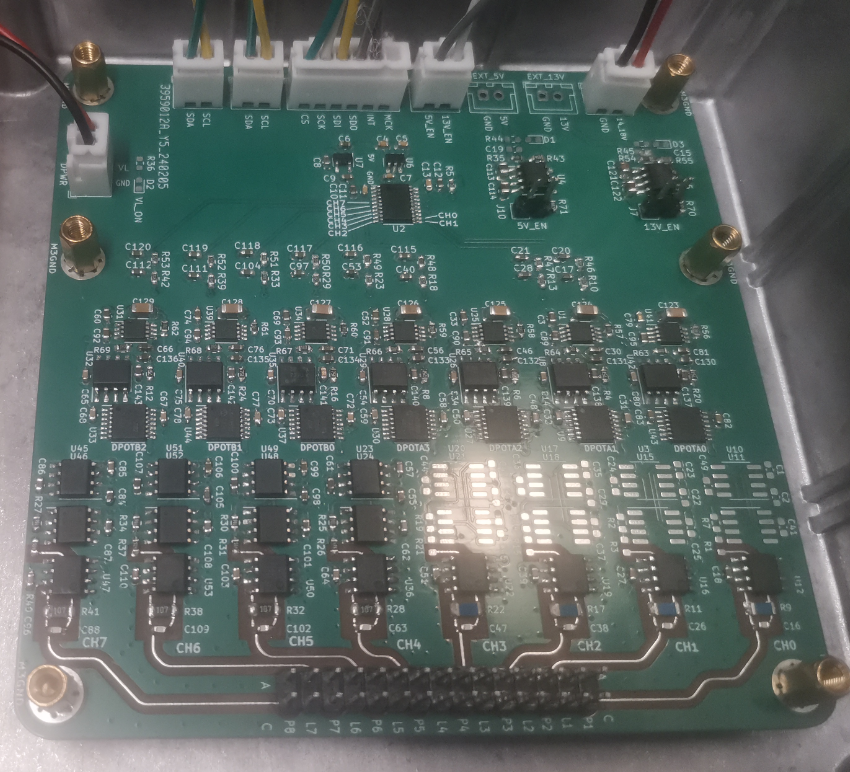
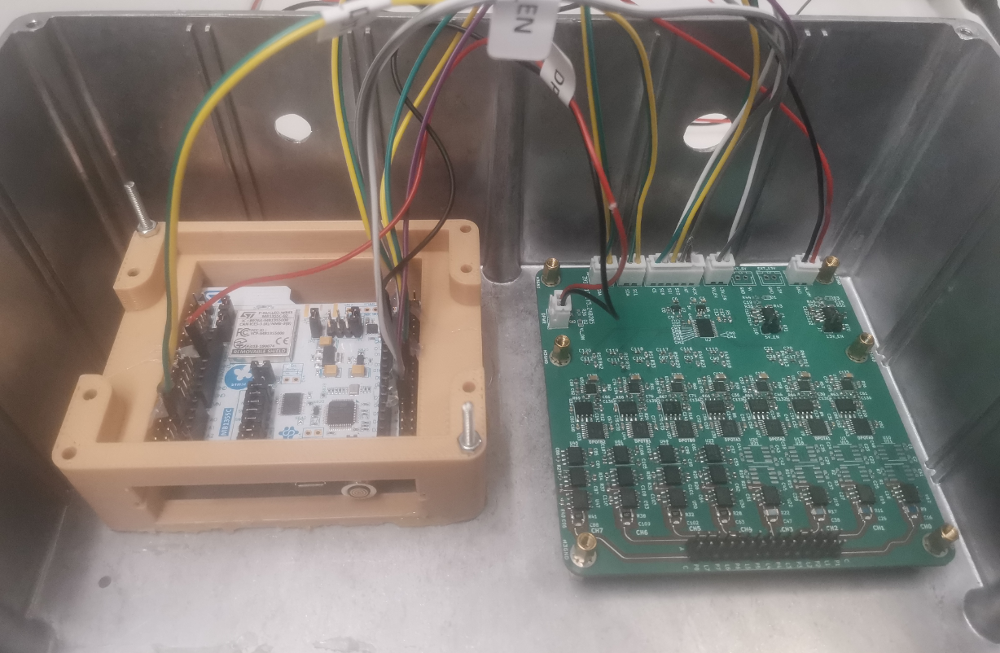
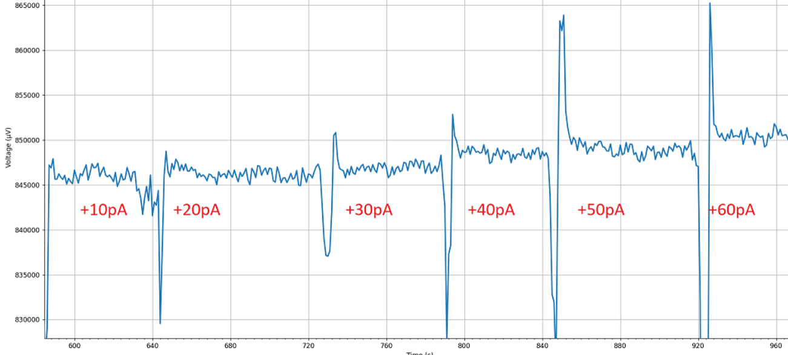

# TIABT

This circuit is used for controlling LEDs and measure photodiodes.

Specification
* Power input
    * 16V to 20V
    * Max 0.2A
* 8 channels current measurment
    * 10pA resolution from 1µA current offset
    * Optional 1µA current subtractor
    * Supports large range of feedback resistor in TIA
* 7 channels LED driver
    * Software controlled current
    * 0.3mA to 2.14mA, 255 steps
    * Up to 12V
    * Enable and Disable

## Board

## Box

## 10pA measuement of one channel
* Feedback resistor is `100Mohm`
* Current subtractor, `1µA` 
* `1µA` plus `n*10pA`, n=1,2,3,4,5,6 steps from SMU with coaxial cable
* SMU is Keysight B2910BL

